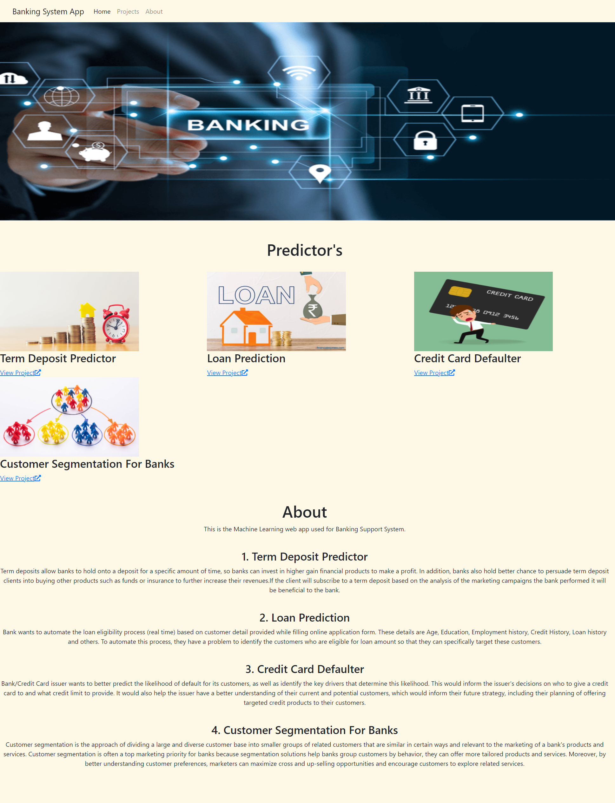

# Banking System App 💰

All Bank related models in one place 🎉

### For accessing the app, click on this link:
http://bsapp.c1.biz/

Here's the preview :

### Problem Statements:
- Term Deposit : There has been a revenue decline for a bank and they would like to know what actions to take. After investigation, they found out that the root cause is that their clients are not depositing as frequently as before. Knowing that term deposits allow banks to hold onto a deposit for a specific amount of time, so banks can invest in higher gain financial products to make a profit. In addition, banks also hold better chance to persuade term deposit clients into buying other products such as funds or insurance to further increase their revenues. As a result, the bank would like to identify existing clients that have higher chance to subscribe for a term deposit and focus marketing efforts on such clients.
- Loan Prediction : This project helps us to determine typical features and patterns of behaviour that lead to a future inability to make debt repayments. On the basis of several features of the customer, a model has been built which advises the bank whether they should give the loan to the same customer. Our solution will assess the probability of future default for each client.
- Credit Card Defaulter - This project aimed at the case of customers default payments and compares the predictive accuracy of probability of default. From the perspective of risk management, the result of predictive accuracy of the estimated probability of default will be more valuable than the binary result of classification - credible or not credible clients. Because the real probability of default is unknown. The model predicts the probabily of default for the customer.
- Customer Segmentation For Banks : In this project extensive data on the bank's customers for the past 6 months has been provided . Data includes transactions frequency, amount, tenure..etc. The bank marketing team would like to leverage AL/ML to launch a targeted marketing ad campaign that is tailored to specific group of customers. In order for this campaign to be successful, the bank has to divide its customers into distinctive groups. This process is known as "marketing segmentation" and it crucial for maximizing marketing campaign conversion rate.

## Projects Preview
<image src=images/screencapture-term-deposit-herokuapp-2021-11-27-21_26_16.png width="600" height="600">
<image src=images/screencapture-bank-loan5-herokuapp-2021-11-27-21_30_09.png width="600" height="600">
<image src=images/screencapture-creditcarddeafaultpredictor-herokuapp-2021-11-27-21_30_44.png width="600" height="600">
<image src=images/screencapture-customer-segmentation23-herokuapp-2021-11-27-21_34_58.png width="600" height="600">   

## Steps followed

- Data Collection
- Data Analysis
- Data Visualization
- Feature Engineering
- Feature Selection
- Model Building
- Model Evalution
- Hyper Parameter Tunning
- Creating Pickle file
- Web App using Streamlit
- Deployment

## Technology used
- Python
- Machine Learning
- Pandas
- Numpy
- Scikit-learn
- Streamlit
- HTML
- CSS
- Pycharm

## Dataset Used:
[Term Deposit](https://www.kaggle.com/jainpooja/banking-project-term-deposit-prediction-model/data)

[Loan Prediction](https://www.kaggle.com/kmldas/loan-default-prediction)

[Credit Card Defaulter](https://www.kaggle.com/selener/prediction-of-credit-card-default/data)

[Customer Segmentation](https://www.kaggle.com/rruchi/bank-customer-segmentation/data) 

## Projects Included In Banking App
[Term Deposit](https://term-deposit.herokuapp.com/)

[Loan Prediction](https://bank-loan5.herokuapp.com/)

[Credit Card Defaulter](https://creditcarddeafaultpredictor.herokuapp.com/)

[Customer Segmentation](https://customer-segmentation23.herokuapp.com/) 

# Thank You !! 👍
